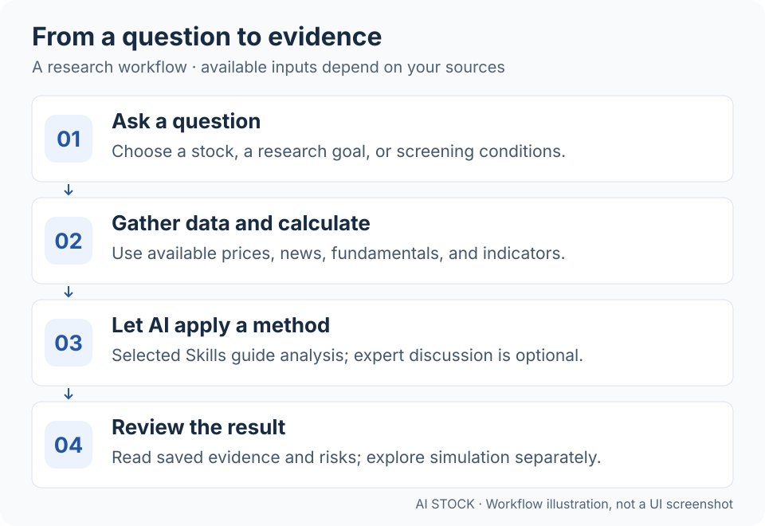
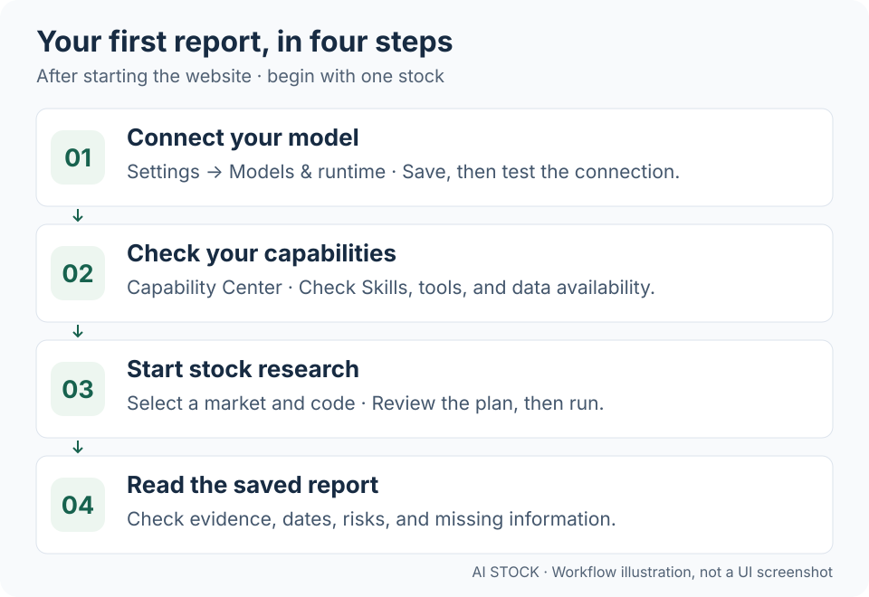

<div align="center">


# AI Stock

**Empower every stock researcher with AI—so one person can research with the capabilities of a team.**

Your AI workspace for researching stocks, comparing ideas, and testing strategies with simulated money.

Research assistant · Expert roundtable · Stock research · Strategy screening · Trade simulation

[](https://github.com/EthanAlgoX/AIStock/actions/workflows/ci.yml)
[](LICENSE)
[](https://www.python.org/)
[](https://react.dev/)
[](https://fastapi.tiangolo.com/)

**English** · [简体中文](docs/README_ZH.md) · [繁體中文](docs/README_CHT.md) · [日本語](docs/README_JA.md) · [한국어](docs/README_KO.md)

</div>

AI Stock brings market data, news, calculations, and AI analysis into one website. Ask about a stock, read the evidence and risks, compare different investing perspectives, and test a strategy through paper trading. Research supports **mainland China, Hong Kong, the US, Taiwan, Japan, Korea, the UK, Canada, Australia, India, Germany and France**. Paper simulation supports the first six markets. Data availability and bounded screening coverage depend on the provider and configuration; see the [market guide](docs/international-markets_EN.md).

## Try it online (recommended)

The easiest way to try AI Stock is the hosted website. **Sign up with an invitation code, then log in to start—no local deployment needed.**

**[Open AI Stock](https://myaistock.top/)** · **[Request an invitation code](mailto:im.hanyx@gmail.com?subject=AI%20Stock%20invitation%20code%20request)**

Click **Request an invitation code** to open your configured default email app with the recipient and subject filled in, then send your request. You will receive a code by email; use it to register on the website, then log in. Already have an account? Log in directly.

> **Use your own email account:** Gmail, Outlook, QQ Mail, 163 Mail, and other providers can all send the request. If no email app opens, right-click or long-press the request link and copy the email address, then compose a message in your usual mailbox with the subject “AI Stock invitation code request”. If you copied the full link, use only the address between `mailto:` and `?` as the recipient.

**Start here:** [What you can do](#what-you-can-do) · [How it works](#how-it-works) · [Quick start](#quick-start) · [Your first report](#your-first-report)

**Choose your language:** Use the language selector at the top of the website. Interface labels follow your selection; saved reports, news and user-written content keep their original language. Report output language is configured separately.

## What you can do

| If you want to… | Open… | What you get |
| --- | --- | --- |
| See what is happening in the market | Market radar | Market snapshots, news, and macro observations |
| Ask a question and follow up | Research assistant | A conversation with saved answers and research |
| Study one stock | Stock research | A report with conclusions, evidence, and risks |
| Compare different investing perspectives | Expert roundtable | Independent AI contributions and a moderator's summary |
| Find stocks that meet your conditions | Strategy screening | Candidates with rankings and selection reasons |
| Check how a strategy behaves | Trade simulation | Daily decisions, simulated fills, and account performance |

**Example question:** “Research AAPL's recent price trend and important news. Separate bullish and bearish evidence, include the dates of the data, and tell me what information is missing.”

Built-in full-market screening rules mainly target A-shares. The “experts” are AI roles based on investment frameworks, not the actual people. Trading experiments use simulated funds and do not place live broker orders.

## How it works

<a href="docs/assets/readme/how-it-works-en.svg"></a>

1. **You set the question or stock scope.** Start with a chat, a stock code, or screening conditions.
2. **The system gathers available evidence.** Data sources supply prices, fundamentals, and news as supported; tools query data and calculate indicators.
3. **AI applies the selected method.** It uses the supplied evidence and strategy instructions to form an analysis. Optional experts examine the topic independently.
4. **You review the result.** Revisit saved reports, inspect risks and missing information, or run a separate trading simulation.

An **Agent** is the AI assistant doing the work. A **Skill** is its analysis playbook. **Tools** perform queries and calculations; **MCP** connects external tools. You can start with enabled defaults and learn these settings later.

Research and simulation have different inputs: a research report can use news and fundamentals when available, while trading decisions use the configured strategy, dated market bars, and simulated account state. See [simulation inputs and limits](docs/strategy-portfolios_EN.md).

## Quick start

For the quickest start, use [AI Stock online](https://myaistock.top/) and [request an invitation code](#try-it-online-recommended). **The installation steps below are only for running your own instance.**

### 1. Prepare your computer

Install **Python 3.10+**, **Node.js 20.19–26.x**, **npm 10+**, and Git. Prepare a model provider's API key and access to a model that supports **tool calling**. Hosted model calls may use paid provider credits; see [model configuration](docs/LLM_CONFIG_GUIDE_EN.md) for supported setup options, including local models.

These commands use a **macOS/Linux shell**. Windows and Docker users can follow the [deployment guide](docs/DEPLOY_EN.md).

### 2. Download and install

```bash
git clone https://github.com/EthanAlgoX/AIStock.git AI-Stock
cd AI-Stock

python3 -m venv .venv
source .venv/bin/activate
pip install -r requirements.txt

# Preserve any existing configuration.
if [ ! -f .env ]; then cp .env.example .env; fi
```

Already have the repository? Start from `cd AI-Stock` in its parent directory and keep your existing `.env`.

### 3. Build the website and start the server

```bash
cd apps/dsa-web
npm ci
npm run build
cd ../..

python main.py --serve-only --host 127.0.0.1 --port 8000
```

Open [http://127.0.0.1:8000](http://127.0.0.1:8000). Keep this terminal running while you use the local instance. Port `8000` is an example; if it is occupied, change `--port` and use the same port in your browser. API documentation is at [http://127.0.0.1:8000/docs](http://127.0.0.1:8000/docs).

**The website opening is only the first step.** Configure and test your model before asking it to analyze stocks.

## Your first report

Using the hosted website? After registration and login, go straight to **Stock research** or **Research assistant**; steps 3–4 below explain how to start and read a report. Steps 1–2 cover model and data setup for your own instance.

<a href="docs/assets/readme/first-report-en.svg"></a>

1. **Connect AI.** In **Settings → Models & runtime**, choose your provider, enter its API key and model details, save, and test the connection. You can also configure the provider in `.env`; see the [model guide](docs/LLM_CONFIG_GUIDE_EN.md).
2. **Check available capabilities.** In the **Capability Center**, check enabled Skills, tools, and data sources. Configure a news source if your question needs recent news. A configured source is not necessarily reachable: use its availability check.
3. **Run one stock.** Open **Stock research**, choose a market, and enter a code: `600519` for an A-share, `hk00700` for a Hong Kong stock, or `AAPL` for a US stock. Review the default plan, adjust your research goal, and start. The plan needs its model, published strategy, and tools to be available.
4. **Read the saved report.** Check the conclusion, supporting evidence, data dates, and risks. Missing data or partial results matter. Use **Research assistant** for follow-up questions, or **Expert roundtable** to compare views.

For a first goal, try: “Explain this stock's recent trend and key risks. Show the evidence and flag anything you cannot verify.” Stock codes here are input examples, not recommendations.

The header lets you switch between English, Simplified Chinese, Traditional Chinese, Japanese, and Korean. Changing the interface language does not translate existing reports.

### If something does not work

| What you see | What to check |
| --- | --- |
| Website opens, but analysis fails | Save and test the model settings; check API access, credits, and tool-calling support |
| A default plan cannot run | Check that its published strategy and required capabilities are enabled |
| News or prices are missing | Check source configuration and availability; review the run's error or partial-result details |
| A background task stops after closing the terminal | The server must remain running; closing a browser tab is different from stopping the server |

## Go further when you are ready

- **Compare viewpoints:** choose experts and pipeline, debate, or voting mode in Expert roundtable. [Collaboration guide](docs/expert-discussion.md) (Chinese)
- **Test a strategy:** choose a Skill in Trade simulation, preview and confirm the stock scope, save, and run once or start daily simulation. Review decisions, costs, and simulated fills. [Trading guide](docs/strategy-portfolios_EN.md)
- **Try JEV decisions (optional):** configure its separate TypeSafe API key in **Settings → Models & runtime**, then select **JEV · Decisions only** for a new trading strategy. JEV returns buy/sell/hold, probabilities, and confidence without a research report; chat and stock-scope selection still need your LLM. Start with the [official access information](https://typesafe.ai/blog/introducing-system-one-models-and-jev), [TypeSafe console](https://console.typesafe.ai/), and [JEV setup guide](docs/jev-trading-decisions.md).
- **Run tasks on a schedule:** keep the server running, locally or on a deployed machine. Your browser can close; a local server stops when its computer is off. [Deployment guide](docs/DEPLOY_EN.md)

## Documentation and development

| You need… | Read… |
| --- | --- |
| All guides | [Documentation index](docs/INDEX_EN.md) |
| Model providers and API keys | [Model configuration](docs/LLM_CONFIG_GUIDE_EN.md) |
| Configuration and notifications | [Full guide](docs/full-guide_EN.md) |
| Deployment options | [Deployment](docs/DEPLOY_EN.md) |
| Task architecture and capability permissions | [Workspace architecture](docs/web-decision-workspace.md) |
| An optional external Agent engine | [Runtime integration](docs/agent-runtime-integration_EN.md) |
| Checks and release history | [Testing](docs/testing.md) · [Changelog](docs/CHANGELOG.md) |

For frontend development, keep the backend running and run `npm run dev` in `apps/dsa-web`. Vite defaults to port `5173` and proxies `/api` to backend port `8000`; use `DSA_WEB_API_PROXY_TARGET` if the backend address differs.

```bash
# From the repository root
./scripts/ci_gate.sh

cd apps/dsa-web
npm run lint
npm run build
```

## License and scope

[MIT License](LICENSE). AI Stock is for investment research and controlled historical or paper-trading experiments. Reports and simulated performance do not guarantee future returns. Historical AI replay can be affected by knowledge in model training; it is not proof of a profitable strategy.

Previously named LLM TradeBot and InvestCrew; the current product name is **AI Stock** and the repository is `EthanAlgoX/AIStock`.
