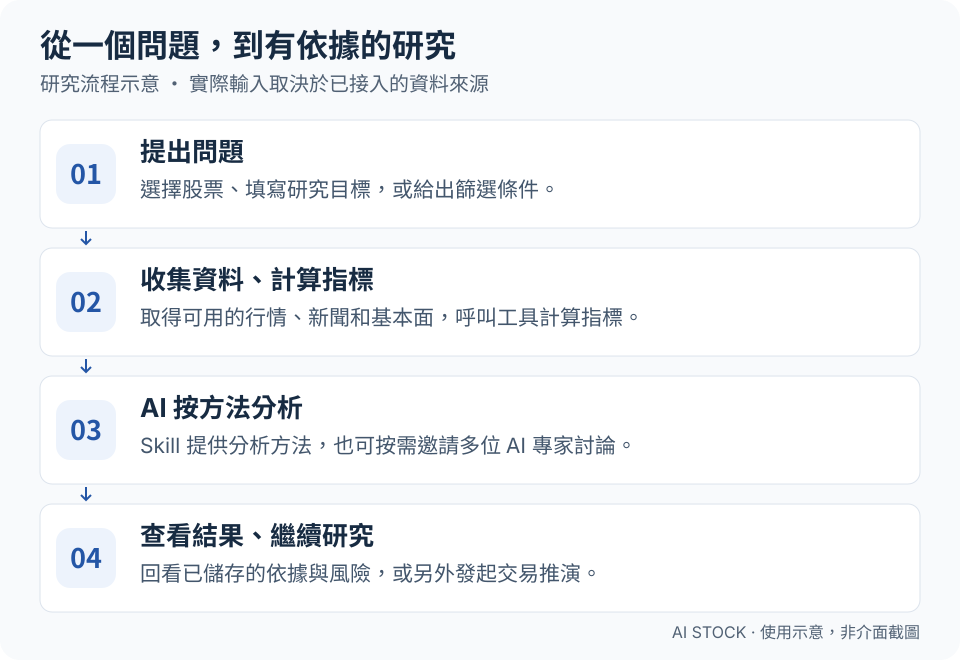
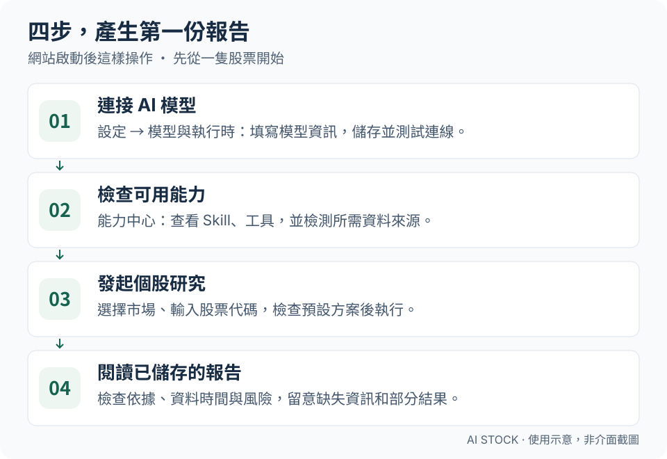

<div align="center">


# AI Stock

**用 AI 賦能每一位股票研究者，讓個人也能擁有投研團隊的研究能力，成為投資研究中的超級個體。**

讓 AI 幫你查股票、看依據、比較觀點，再用模擬資金檢驗策略。

投研助理 · 專家圓桌 · 個股研究 · 策略選股 · 交易推演

[English](../README.md) · [简体中文](README_ZH.md) · **繁體中文** · [日本語](README_JA.md) · [한국어](README_KO.md)

</div>

AI Stock 把行情、新聞、指標計算和 AI 分析放進同一個網站。你可以研究一隻股票、查看依據和風險、比較不同投資風格的觀點，再用模擬交易觀察策略表現。研究支援 **A 股、港股、美股、台股、日股、韓股，以及英、加、澳、印、德、法股票**；交易推演支援前六個市場。行情可用性及選股候選範圍取決於資料來源與設定，詳見[海外市場指南（英文）](international-markets_EN.md)。

## 線上體驗（推薦）

想先體驗？推薦直接使用已上線的 AI Stock 網站。**填寫邀請碼註冊可獲得平台每日額度；不填邀請碼也能註冊，在「我的帳戶」設定個人 LLM API 即可使用。無需自行部署。**

**[立即線上體驗](https://myaistock.top/)** · **[申請邀請碼](mailto:im.hanyx@gmail.com?subject=AI%20Stock%20%E9%82%80%E8%AB%8B%E7%A2%BC%E7%94%B3%E8%AB%8B)**

點選**申請邀請碼**會嘗試開啟你已設定的預設郵件應用程式，並填好收件人與主旨；寄出申請郵件後，作者會透過郵件回覆邀請碼。收到後前往網站註冊並登入即可。已有帳號的使用者可以直接登入。

> **可以用你自己的信箱申請：** Gmail、QQ 信箱、163 信箱、Outlook 等均可。若點選後未開啟郵件應用程式，可在申請連結上按右鍵或長按，複製郵件地址，再到常用信箱新增郵件，主旨填寫「AI Stock 邀請碼申請」。若複製的是完整連結，只取 `mailto:` 後、`?` 前的地址作為收件人。

**從這裡開始：** [能做什麼](#能做什麼) · [如何運作](#如何運作) · [安裝並啟動](#安裝並啟動) · [產生第一份報告](#產生第一份報告)

**選擇語言：** 在網站頂部切換介面語言。介面文字會隨選擇切換；歷史報告、新聞原文及使用者自訂內容保留原文。報告輸出語言需另外設定。

## 能做什麼

| 你想做的事 | 開啟哪裡 | 能得到什麼 |
| --- | --- | --- |
| 看今天市場發生了什麼 | 市場雷達 | 行情快照、新聞和總體經濟觀察 |
| 隨時提問、繼續追問 | 投研助理 | 可以回看的對話與研究結果 |
| 深入了解一隻股票 | 個股研究 | 包含結論、依據和風險的報告 |
| 聽聽不同投資風格的觀點 | 專家圓桌 | 多位 AI 獨立分析，以及主持人總結 |
| 按條件找股票 | 策略選股 | 候選清單、排名和入選理由 |
| 看一個策略實際會怎麼操作 | 交易推演 | 每日決策、模擬成交和帳戶表現 |
| 研究加密貨幣現貨 | 市場雷達、個股研究、策略選股、交易推演及持倉管理 | USDT 現貨行情、選幣、持久化日線規則回測及模擬持倉 |

**可以這樣提問：**「幫我研究 AAPL 最近的走勢和重要新聞，分別列出看好與看空的依據，標明資料時間，以及哪些資訊還缺失。」

內建全市場篩選規則主要面向 A 股。「專家」是依投資框架設定的 AI 角色，並非本人。交易推演使用模擬資金，不會向券商提交實盤訂單。

在原有模組的市場選項中選擇「加密貨幣」，即可使用 24/7 Binance 現貨模擬；不會向交易所下單。詳見[現貨說明（英文）](crypto-spot_EN.md)。

## 如何運作

<a href="assets/readme/how-it-works-zh-TW.svg"></a>

1. **你給出問題或股票範圍。** 可以從一句話、一個股票代碼或一組篩選條件開始。
2. **系統找資料、算指標。** 依資料來源支援情況取得行情、基本面和新聞，呼叫工具查詢資料、計算指標。
3. **AI 按方法分析。** 結合取得的依據和策略說明形成判斷，也可以邀請多位 AI 專家獨立分析。
4. **你查看結果。** 回看報告、檢查風險和缺失資訊，或另外發起交易推演，觀察策略表現。

頁面裡的 **Agent** 就是執行工作的 AI 助手，**Skill** 是分析方法說明書，**Tool** 是查詢和計算工具，**MCP** 是連接外部工具的介面。第一次使用可以先選已啟用的預設方案，不必先弄懂所有設定。

研究與模擬交易的輸入不同：研究任務可以使用已接入的新聞、基本面等資料；交易決策使用所選策略、截至決策日的行情與模擬帳戶狀態。詳細限制見[交易推演說明](strategy-portfolios.md)（簡體中文）。

## 安裝並啟動

推薦先[線上體驗 AI Stock](https://myaistock.top/)，依上方說明[申請邀請碼](#線上體驗推薦)。**以下安裝步驟僅供希望自行部署的使用者參考。**

### 1. 準備環境

安裝 **Python 3.10+、Node.js 20.19–26.x、npm 10+ 和 Git**。準備模型服務的 API Key（允許軟體呼叫 AI 的金鑰），並確認所選模型支援**工具呼叫**。線上模型可能依服務商規則消耗付費額度；也可以按[模型設定指南](LLM_CONFIG_GUIDE.md)（簡體中文）了解本機模型等接入方式。

以下命令適用於 **macOS / Linux 終端機**。Windows PowerShell 啟用虛擬環境時，請將 `source .venv/bin/activate` 換成 `.venv\Scripts\Activate.ps1`；若 Python 指令為 `python`，建立環境時也請使用該指令。Docker 部署請看[部署指南](DEPLOY.md)（簡體中文）。

### 2. 下載專案、安裝依賴

```bash
git clone https://github.com/EthanAlgoX/AIStock.git AI-Stock
cd AI-Stock

python3 -m venv .venv
source .venv/bin/activate
pip install -r requirements.txt

# 只在沒有設定檔時建立，保留現有設定。
if [ ! -f .env ]; then cp .env.example .env; fi
```

Windows PowerShell 的最後一行請改用 `if (!(Test-Path .env)) { Copy-Item .env.example .env }`。已下載過專案時，在專案的上層目錄從 `cd AI-Stock` 開始即可，保留現有 `.env`。

### 3. 建置網頁、啟動服務

```bash
cd apps/dsa-web
npm ci
npm run build
cd ../..

python main.py --serve-only --host 127.0.0.1 --port 8000
```

瀏覽器開啟 [http://127.0.0.1:8000](http://127.0.0.1:8000)。本機使用期間，請保持這個終端機執行。`8000` 是範例連接埠；若已被占用，可修改 `--port`，瀏覽器網址也要使用相同連接埠。API 文件位於 [http://127.0.0.1:8000/docs](http://127.0.0.1:8000/docs)。

**能開啟網頁只是第一步。** 完成下列模型設定後，才能開始 AI 分析。

## 產生第一份報告

使用線上網站的使用者，註冊登入後直接進入**個股研究**或**投研助理**即可體驗；下列第 3–4 步介紹如何發起研究和閱讀報告。第 1–2 步的模型與資料設定適用於自行部署的使用者。

<a href="assets/readme/first-report-zh-TW.svg"></a>

1. **接通 AI。** 進入**設定 → 模型與執行時**，選擇服務商，填寫 API Key 和模型資訊，儲存後測試連線。也可以在 `.env` 中設定，欄位說明見[模型設定指南](LLM_CONFIG_GUIDE.md)（簡體中文）。
2. **檢查可用能力。** 在**能力中心**查看已啟用的 Skill、工具和資料來源。需要近期新聞時，設定相應新聞來源；「已設定」不代表連線成功，可使用來源的可用性檢測。
3. **先分析一隻股票。** 開啟**個股研究**，選擇市場並輸入代碼，例如 A 股 `600519`、港股 `hk00700`、美股 `AAPL`。查看預設方案，按需填寫研究目標，再執行。預設方案仍需要對應模型、正式策略和工具可用。
4. **讀報告、看依據。** 檢查結論、資料時間、依據和風險，留意資訊缺失與部分產出。想繼續問就到**投研助理**，想比較不同觀點就到**專家圓桌**。

第一次的研究目標可以寫：「解釋這隻股票最近的趨勢和主要風險，列出依據，無法確認的資訊請明確說明。」上述股票代碼僅用於示範輸入格式，不代表推薦。

頂部可切換英文、簡體中文、繁體中文、日文和韓文，並保留你的選擇。首次使用預設為英文；切換介面語言不會翻譯已有報告。定期報告等輸出可設定 `REPORT_LANGUAGE=zh-TW`，詳見[語言說明](ui-languages.md)（簡體中文／英文摘要）。

### 遇到問題先看這裡

| 現象 | 先檢查什麼 |
| --- | --- |
| 網頁能開啟，分析卻失敗 | 模型設定是否已儲存並測試通過，Key 是否有權限與額度，模型是否支援工具呼叫 |
| 預設方案無法執行 | 對應正式策略和所需能力是否已啟用 |
| 沒有新聞或行情 | 資料來源設定與可用性，以及執行紀錄中的錯誤或部分結果說明 |
| 關閉終端機後任務不再執行 | 服務必須保持執行；關閉瀏覽器頁面與停止伺服器是兩回事 |

## 熟悉後，還可以做什麼

- **比較不同觀點：** 在專家圓桌選擇專家，以及流水線、辯論或投票協作方式。[專家協作說明](expert-discussion.md)（簡體中文）
- **檢驗交易策略：** 在交易推演選擇 Skill，預覽並確認股票範圍，儲存後執行一次或啟動每日模擬。查看決策、交易成本和模擬成交。[交易推演指南](strategy-portfolios.md)（簡體中文）
- **嘗試 JEV 決策（可選）：** 在**設定 → 模型與執行時**設定獨立的 TypeSafe API Key，新增交易策略時選擇 **JEV · 僅決策結果**。它回傳買入／賣出／不動、機率與信心度，不產生研究報告；對話和股票範圍篩選仍需要 LLM。申請入口見 [JEV 官方說明](https://typesafe.ai/blog/introducing-system-one-models-and-jev)與 [TypeSafe 控制台](https://console.typesafe.ai/)（英文），使用方法見 [JEV 設定指南](jev-trading-decisions.md)（英文／簡體中文）。
- **讓任務定時執行：** 在本機或伺服器上持續執行服務，瀏覽器可以關閉；若服務就在本機，電腦關機後任務也會停止。[部署指南](DEPLOY.md)（簡體中文）

## 文件與開發入口

下列專題文件以簡體中文為主，執行引擎另有英文版本。

| 你需要了解 | 對應文件 |
| --- | --- |
| 全部使用指南 | [文件索引](INDEX.md) |
| 模型服務與 API Key | [模型設定](LLM_CONFIG_GUIDE.md) |
| 詳細設定與通知 | [完整指南](full-guide.md) |
| 部署方式 | [部署指南](DEPLOY.md) |
| 任務架構與能力權限 | [工作台架構](web-decision-workspace.md) |
| 可選的外部 Agent 引擎 | [執行引擎接入](agent-runtime-integration.md) |
| 測試與版本變化 | [測試指南](testing.md) · [更新紀錄](CHANGELOG.md) |

前端開發時，保持後端執行，在 `apps/dsa-web` 執行 `npm run dev`。Vite 預設使用 `5173` 連接埠，將 `/api` 代理到後端 `8000` 連接埠；後端位址不同時設定 `DSA_WEB_API_PROXY_TARGET`。

```bash
# 在儲存庫根目錄執行
./scripts/ci_gate.sh

cd apps/dsa-web
npm run lint
npm run build
```

## 授權與使用範圍

本專案採用 [MIT License](../LICENSE)，用於投資研究及受控的歷史或模擬交易實驗。報告和模擬收益不保證未來表現；AI 歷史回放可能受到模型訓練知識的影響，不能據此認定策略能夠獲利。

專案曾用名 LLM TradeBot、InvestCrew，現統一為 **AI Stock**，GitHub 儲存庫為 `EthanAlgoX/AIStock`。
