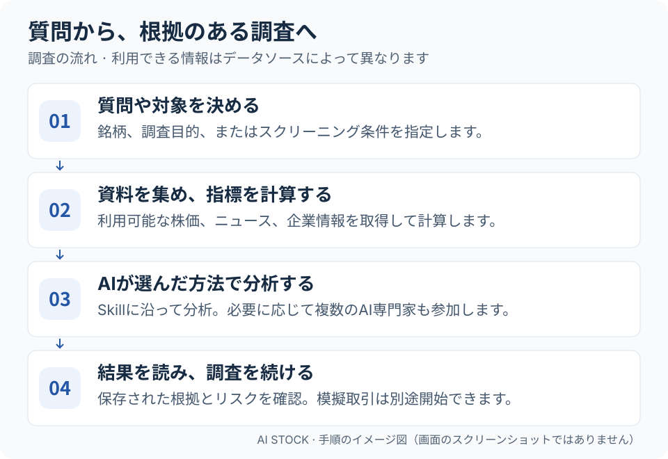
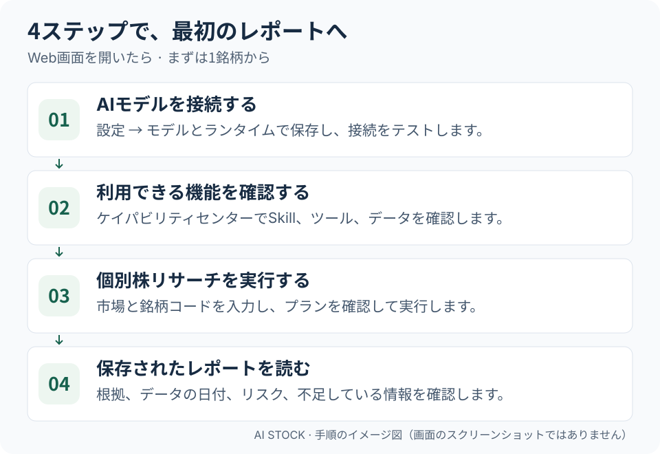

<div align="center">


# AI Stock

**AIで、一人ひとりの株式リサーチをもっと強く。一人でもチームのように調査できる力を。**

AIで株を調べ、根拠と意見を比較し、仮想資金で戦略を試す。

投資リサーチアシスタント · 専門家ラウンドテーブル · 個別株リサーチ · 戦略銘柄選定 · 取引シミュレーション

[English](../README.md) · [简体中文](README_ZH.md) · [繁體中文](README_CHT.md) · **日本語** · [한국어](README_KO.md)

</div>

AI Stockは、株価データ、ニュース、指標計算、AIによる分析をひとつのWebサイトにまとめたツールです。気になる銘柄を調べ、根拠やリスクを確認し、異なる投資スタイルの意見を比較して、模擬取引で戦略の動きを確かめられます。調査対象は**中国本土のA株、香港、米国、台湾、日本、韓国、英国、カナダ、オーストラリア、インド、ドイツ、フランスの株式**です。模擬取引は最初の6市場に対応します。データと候補銘柄の範囲は提供元・設定によって異なります。[市場ガイド（英語）](international-markets_EN.md)をご確認ください。

日本語対応は画面と出力言語に関するもので、日本株市場のデータ対応を意味しません。

## オンラインで試す（おすすめ）

まずは公開中のAI Stockサイトをお試しください。**招待コードで登録すると毎日の利用枠が付与されます。コードなしでも登録でき、マイアカウントで個人の LLM API を設定して利用できます。自分でのサーバー構築は不要です。**

**[AI Stockを開く](https://myaistock.top/)** · **[招待コードを申請する](mailto:im.hanyx@gmail.com?subject=AI%20Stock%20%E6%8B%9B%E5%BE%85%E3%82%B3%E3%83%BC%E3%83%89%E3%81%AE%E7%94%B3%E8%AB%8B)**

**招待コードを申請する**をクリックすると、設定済みの既定のメールアプリで宛先と件名を入力した作成画面を開こうとします。管理者に申請メールを送ると、招待コードがメールで届きます。そのコードでサイトに登録し、ログインしてください。アカウントをお持ちの場合は、そのままログインできます。

> **普段のメールアカウントで申請できます：** Gmail、Outlook、その他のメールサービスを利用できます。メールアプリが開かない場合は、申請リンクを右クリックまたは長押ししてメールアドレスをコピーし、普段のメールサービスで件名を「AI Stock 招待コードの申請」として送信してください。リンク全体をコピーした場合、宛先には `mailto:` の後から `?` の前までのアドレスだけを使います。

**ここから始める：** [できること](#できること) · [仕組み](#仕組み) · [インストールと起動](#インストールと起動) · [最初のレポートを作る](#最初のレポートを作る)

**言語の選択：** サイト上部の言語メニューで表示言語を切り替えられます。画面の文言は選択した言語になります。保存済みレポート、ニュース、ユーザーが入力した内容は原文のままです。レポートの出力言語は別途設定します。

## できること

| やりたいこと | 開く画面 | 得られるもの |
| --- | --- | --- |
| 市場で何が起きているか知る | 市場レーダー | 市場データ、ニュース、マクロ経済の動向 |
| 質問して、さらに掘り下げる | 投資リサーチアシスタント | 後から読み返せる対話と調査結果 |
| ひとつの銘柄を詳しく調べる | 個別株リサーチ | 結論、根拠、リスクをまとめたレポート |
| 異なる投資スタイルの意見を聞く | 専門家ラウンドテーブル | 複数のAIによる独立した分析と進行役のまとめ |
| 条件に合う銘柄を探す | 戦略銘柄選定 | 候補銘柄、順位、選定理由 |
| 戦略がどう売買するか確かめる | 取引シミュレーション | 日々の判断、模擬約定、口座の運用成績 |
| 暗号資産の現物を調べる | 市場レーダー、個別銘柄リサーチ、選定、取引シミュレーション、保有管理 | USDT建て相場、通貨選定、保存済み日足ルールのバックテスト、模擬保有 |

**質問の例：**「AAPLの最近の値動きと重要なニュースを調べてください。強気と弱気の根拠を分け、データの日付と不足している情報も示してください。」

標準の全市場スクリーニングルールは主にA株向けです。「専門家」は投資の考え方に基づくAIの役割で、実在の人物本人ではありません。取引シミュレーションは仮想資金を使い、証券会社への実注文は行いません。

既存機能の市場選択で**暗号資産**を選び、共通の戦略保存・日次シミュレーション・バックテストを利用します。UTCの確定済み日足を使用します。取引所への実注文は行いません。[現物ガイド（英語）](crypto-spot_EN.md)をご覧ください。

## 仕組み

<a href="assets/readme/how-it-works-ja.svg"></a>

1. **質問や対象銘柄を決める。** 一文の質問、銘柄コード、またはスクリーニング条件から始められます。
2. **システムが資料を集め、計算する。** 利用可能な株価、企業情報、ニュースを取得し、ツールでデータの照会や指標計算を行います。
3. **AIが選んだ方法で分析する。** 取得した根拠と戦略の指示に沿って分析します。必要に応じて複数のAI専門家も参加できます。
4. **結果を確認する。** 保存されたレポートの根拠、リスク、情報の不足を確認します。取引シミュレーションは別途開始できます。

**Agent**は作業を進めるAIアシスタント、**Skill**は分析の手順書です。**Tool**はデータ照会や計算を行い、**MCP**は外部ツールを接続します。最初は有効な標準プランを使えばよく、すべての設定を先に覚える必要はありません。

調査と模擬取引では入力が異なります。調査では接続済みのニュースや企業情報などを利用できますが、売買判断では戦略、判断日までの相場データ、模擬口座の状態を使います。詳しくは[取引シミュレーションの説明](strategy-portfolios_EN.md)（英語）をご覧ください。

## インストールと起動

手軽に始めるなら[AI Stockの公開サイト](https://myaistock.top/)をご利用ください。[招待コードの申請方法](#オンラインで試すおすすめ)は上記のとおりです。**以下は自分の環境にインストールする場合の手順です。**

### 1. 環境を準備する

**Python 3.10以降、Node.js 20.19〜26.x、npm 10以降、Git**が必要です。モデルサービスのAPIキーと、**ツール呼び出しに対応するモデル**を用意してください。外部サービスのモデルは利用料金がかかる場合があります。ローカルモデルを含む設定方法は[モデル設定ガイド](LLM_CONFIG_GUIDE_EN.md)（英語）にあります。

以下は**macOS / Linuxのシェル**用コマンドです。Windows PowerShellでは `source .venv/bin/activate` の代わりに `.venv\Scripts\Activate.ps1` を使います。Pythonのコマンド名が `python` の環境では、仮想環境の作成にもその名前を使ってください。Dockerについては[デプロイガイド](DEPLOY_EN.md)（英語）をご覧ください。

### 2. ダウンロードして依存関係をインストールする

```bash
git clone https://github.com/EthanAlgoX/AIStock.git AI-Stock
cd AI-Stock

python3 -m venv .venv
source .venv/bin/activate
pip install -r requirements.txt

# 既存の設定ファイルは上書きしません。
if [ ! -f .env ]; then cp .env.example .env; fi
```

Windows PowerShellでは最後の行を `if (!(Test-Path .env)) { Copy-Item .env.example .env }` に置き換えてください。取得済みのリポジトリを使う場合は、親ディレクトリから `cd AI-Stock` で入り、既存の `.env` を保持します。

### 3. Web画面をビルドして起動する

```bash
cd apps/dsa-web
npm ci
npm run build
cd ../..

python main.py --serve-only --host 127.0.0.1 --port 8000
```

ブラウザーで [http://127.0.0.1:8000](http://127.0.0.1:8000) を開きます。ローカルで利用している間は、このターミナルを起動したままにしてください。`8000` はポート番号の例です。使用中の場合は `--port` を変更し、ブラウザーでも同じ番号を使います。APIドキュメントは [http://127.0.0.1:8000/docs](http://127.0.0.1:8000/docs) です。

**Web画面が開くだけでは、分析の準備は完了していません。** 次の手順でモデルを設定してください。

## 最初のレポートを作る

公開サイトを利用する場合は、登録・ログイン後に**個別株リサーチ**または**投資リサーチアシスタント**を開いてください。調査の開始とレポートの読み方は手順3〜4で説明します。手順1〜2のモデルとデータの設定は、自分で環境を構築する場合に必要です。

<a href="assets/readme/first-report-ja.svg"></a>

1. **AIを接続する。** **設定 → モデルとランタイム**で提供元、APIキー、モデル情報を入力し、保存して接続をテストします。`.env` でも設定できます。[モデル設定ガイド](LLM_CONFIG_GUIDE_EN.md)（英語）
2. **利用可能な機能を確認する。** **ケイパビリティセンター**で、有効なSkill、ツール、データソースを確認します。最近のニュースが必要ならニュースソースも設定します。設定済みでも接続できるとは限らないため、利用可否のチェックを行ってください。
3. **まず1銘柄を調べる。** **個別株リサーチ**で市場とコードを入力します。例はA株の `600519`、香港株の `hk00700`、米国株の `AAPL` です。標準プランを確認し、調査目的を調整して実行します。対応するモデル、公開済み戦略、ツールが利用可能である必要があります。
4. **根拠とともにレポートを読む。** 結論、データの日付、根拠、リスクを確認し、情報不足や一部のみの結果にも注意します。追加の質問は**投資リサーチアシスタント**、意見の比較は**専門家ラウンドテーブル**で行えます。

最初の調査目的は「この銘柄の最近のトレンドと主なリスクを、根拠付きで説明してください。確認できない点は明記してください」などで十分です。上記のコードは入力例であり、銘柄の推奨ではありません。

画面上部で英語、簡体字中国語、繁体字中国語、日本語、韓国語を選べます。初回は英語ですが、選んだ言語は保存されます。画面言語を変えても過去のレポートは翻訳されません。定期レポートなどは `REPORT_LANGUAGE=ja` で出力言語を設定できます。[言語の説明](ui-languages.md)（簡体字中国語／英語要約）

### うまく動かないとき

| 状況 | 確認すること |
| --- | --- |
| Web画面は開くが分析に失敗する | モデル設定の保存と接続テスト、APIの権限と残高、ツール呼び出し対応 |
| 標準プランを実行できない | 対応する公開済み戦略と必要な機能が有効か |
| ニュースや株価が取得できない | データソースの設定と利用可否、実行履歴のエラーや部分的な結果 |
| ターミナルを閉じるとタスクが止まる | サーバーは起動し続ける必要があります。ブラウザーを閉じることとは異なります |

## 慣れたら試せること

- **意見を比較する：** 専門家ラウンドテーブルで参加者と、パイプライン・討論・投票の協業方式を選びます。[専門家の協業](expert-discussion.md)（簡体字中国語）
- **戦略を試す：** 取引シミュレーションでSkillを選び、銘柄範囲をプレビューして確定・保存します。1回の実行や日次の模擬取引を開始し、判断、コスト、模擬約定を確認できます。[取引ガイド](strategy-portfolios_EN.md)（英語）
- **JEVを使う（任意）：** **設定 → モデルとランタイム**に専用のTypeSafe APIキーを登録し、新規戦略で **JEV · 判断結果のみ**を選択します。買い・売り・見送り、確率、信頼度を返し、調査レポートは生成しません。対話や銘柄範囲の選定には引き続きLLMが必要です。[公式アクセス案内](https://typesafe.ai/blog/introducing-system-one-models-and-jev)と[TypeSafeコンソール](https://console.typesafe.ai/)（英語）、[JEV設定ガイド](jev-trading-decisions.md)（英語／簡体字中国語）をご覧ください。
- **定期実行する：** ローカルまたは別のマシンでサーバーを動かし続ければ、ブラウザーは閉じられます。自分のパソコンがサーバーの場合、その電源を切るとタスクも停止します。[デプロイガイド](DEPLOY_EN.md)（英語）

## ドキュメントと開発

| 知りたいこと | ドキュメント |
| --- | --- |
| ガイドの一覧 | [ドキュメント一覧](INDEX_EN.md)（英語） |
| モデルとAPIキー | [モデル設定](LLM_CONFIG_GUIDE_EN.md)（英語） |
| 詳細設定と通知 | [全体ガイド](full-guide_EN.md)（英語） |
| デプロイ方法 | [デプロイ](DEPLOY_EN.md)（英語） |
| タスクの構造と機能の権限 | [ワークスペースの構造](web-decision-workspace.md)（簡体字中国語） |
| 任意の外部Agentエンジン | [ランタイム統合](agent-runtime-integration_EN.md)（英語） |
| 検証と変更内容 | [テスト](testing.md) · [変更履歴](CHANGELOG.md)（主に簡体字中国語） |

フロントエンド開発では、バックエンドを起動したまま `apps/dsa-web` で `npm run dev` を実行します。Viteは既定でポート `5173` を使い、`/api` をバックエンドの `8000` に転送します。接続先が異なる場合は `DSA_WEB_API_PROXY_TARGET` を設定します。

```bash
# リポジトリのルートから実行
./scripts/ci_gate.sh

cd apps/dsa-web
npm run lint
npm run build
```

## ライセンスと利用範囲

[MIT License](../LICENSE)。投資調査と、管理された歴史データの検証・模擬取引のためのプロジェクトです。レポートや模擬取引の成績は将来の利益を保証しません。AIによる過去の相場の再現には学習済み知識が影響する場合があり、戦略の収益性を証明するものではありません。

旧名称はLLM TradeBot、InvestCrewでした。現在の名称は **AI Stock**、リポジトリは `EthanAlgoX/AIStock` です。
