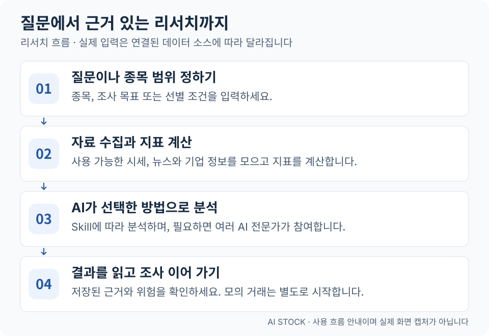
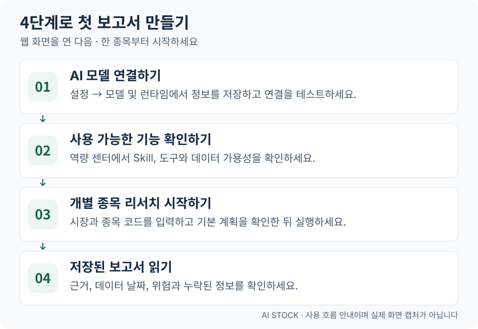

<div align="center">


# AI Stock

**AI로 모든 주식 연구자의 역량을 넓힙니다. 혼자서도 리서치 팀처럼 조사하고 분석할 수 있도록.**

AI로 종목을 조사하고, 근거와 관점을 비교하고, 가상 자금으로 전략을 시험하세요.

투자 리서치 어시스턴트 · 전문가 라운드테이블 · 개별 종목 리서치 · 전략 종목 선별 · 거래 시뮬레이션

[English](../README.md) · [简体中文](README_ZH.md) · [繁體中文](README_CHT.md) · [日本語](README_JA.md) · **한국어**

</div>

AI Stock은 시세, 뉴스, 지표 계산과 AI 분석을 한 웹사이트에 모은 도구입니다. 관심 종목을 조사하고 근거와 위험을 살펴본 뒤, 서로 다른 투자 관점을 비교하거나 모의 거래로 전략의 움직임을 확인할 수 있습니다. **중국 본토 A주, 홍콩 주식, 미국 주식**을 지원하며, 실제 이용 범위는 데이터 소스와 전략에 따라 달라집니다.

한국어 지원은 화면과 출력 언어에 관한 것으로, 한국 주식시장 데이터 지원을 의미하지 않습니다.

## 온라인으로 체험하기 (추천)

먼저 운영 중인 AI Stock 웹사이트를 이용해 보세요. **초대 코드로 가입한 뒤 로그인하면 바로 체험할 수 있습니다. 다운로드하거나 직접 배포할 필요가 없습니다.**

**[AI Stock 열기](https://myaistock.top/)** · **[초대 코드 신청하기](mailto:im.hanyx@gmail.com?subject=AI%20Stock%20%EC%B4%88%EB%8C%80%20%EC%BD%94%EB%93%9C%20%EC%8B%A0%EC%B2%AD)**

**초대 코드 신청하기**를 누르면 설정된 기본 메일 앱에서 받는 사람과 제목이 입력된 작성 창을 열도록 요청합니다. 운영자에게 신청 메일을 보내면 이메일로 초대 코드를 받을 수 있습니다. 받은 코드로 사이트에 가입한 뒤 로그인하세요. 이미 계정이 있다면 바로 로그인할 수 있습니다.

> **평소 사용하는 이메일 계정으로 신청하세요:** Gmail, Outlook 등 어떤 메일 서비스로도 보낼 수 있습니다. 메일 앱이 열리지 않으면 신청 링크를 마우스 오른쪽 버튼으로 클릭하거나 길게 눌러 이메일 주소를 복사한 뒤, 평소 사용하는 메일에서 제목을 “AI Stock 초대 코드 신청”으로 작성해 보내세요. 전체 링크가 복사되었다면 `mailto:` 뒤부터 `?` 앞까지의 주소만 받는 사람에 입력하세요.

**여기서 시작하세요:** [할 수 있는 일](#할-수-있는-일) · [작동 방식](#작동-방식) · [설치와 실행](#설치와-실행) · [첫 보고서 만들기](#첫-보고서-만들기)

## 할 수 있는 일

| 하고 싶은 일 | 열어 볼 화면 | 얻을 수 있는 결과 |
| --- | --- | --- |
| 시장에서 무슨 일이 일어나는지 확인하기 | 시장 레이더 | 시장 현황, 뉴스, 거시경제 동향 |
| 질문하고 더 깊이 알아보기 | 투자 리서치 어시스턴트 | 다시 읽을 수 있는 대화와 조사 결과 |
| 한 종목을 자세히 알아보기 | 개별 종목 리서치 | 결론, 근거와 위험을 담은 보고서 |
| 서로 다른 투자 관점 비교하기 | 전문가 라운드테이블 | 여러 AI의 독립적인 분석과 진행자의 요약 |
| 조건에 맞는 종목 찾기 | 전략 종목 선별 | 후보 목록, 순위와 선정 이유 |
| 전략이 어떻게 매매하는지 확인하기 | 거래 시뮬레이션 | 일별 판단, 모의 체결과 계좌 성과 |

**이렇게 질문해 보세요:** “AAPL의 최근 주가 흐름과 주요 뉴스를 조사해 주세요. 상승과 하락을 예상하는 근거를 나누고, 데이터 날짜와 부족한 정보도 알려 주세요.”

내장된 전체 시장 선별 규칙은 주로 A주를 대상으로 합니다. ‘전문가’는 투자 방식에 따라 설정된 AI 역할이며 실제 인물이 아닙니다. 거래 시뮬레이션은 가상 자금을 사용하고 증권사에 실거래 주문을 보내지 않습니다.

## 작동 방식

<a href="assets/readme/how-it-works-ko.svg"></a>

1. **질문이나 종목 범위를 정합니다.** 한 문장의 질문, 종목 코드 또는 선별 조건으로 시작할 수 있습니다.
2. **시스템이 자료를 찾고 계산합니다.** 데이터 소스가 제공하는 시세, 기업 정보와 뉴스를 모으고, 도구로 데이터를 조회하거나 지표를 계산합니다.
3. **AI가 선택한 방법으로 분석합니다.** 확보한 근거와 전략 지침을 바탕으로 분석합니다. 필요하면 여러 AI 전문가가 독립적으로 검토할 수 있습니다.
4. **결과를 살펴봅니다.** 저장된 보고서에서 근거, 위험과 정보 누락을 확인합니다. 거래 시뮬레이션은 별도로 시작할 수 있습니다.

**Agent**는 작업을 수행하는 AI 어시스턴트, **Skill**은 분석 방법을 적은 안내서입니다. **Tool**은 조회와 계산을 맡고, **MCP**는 외부 도구를 연결합니다. 처음에는 활성화된 기본 계획으로 시작하면 되므로 모든 설정을 먼저 익힐 필요는 없습니다.

리서치와 모의 거래의 입력은 다릅니다. 리서치는 연결된 뉴스와 기업 정보 등을 활용할 수 있지만, 매매 판단은 선택한 전략, 판단일까지의 시세와 모의 계좌 상태를 사용합니다. 자세한 범위는 [거래 시뮬레이션 설명](strategy-portfolios_EN.md)(영어)을 참고하세요.

## 설치와 실행

빠르게 시작하려면 [AI Stock 웹사이트](https://myaistock.top/)를 이용하고 위 안내에 따라 [초대 코드를 신청하세요](#온라인으로-체험하기-추천). **아래 설치 단계는 직접 배포하려는 사용자를 위한 안내입니다.**

### 1. 환경 준비하기

**Python 3.10 이상, Node.js 20.19–26.x, npm 10 이상, Git**이 필요합니다. 모델 서비스의 API 키와 **도구 호출을 지원하는 모델**을 준비하세요. 외부 모델 서비스는 이용 요금이 발생할 수 있습니다. 로컬 모델을 포함한 연결 방법은 [모델 설정 가이드](LLM_CONFIG_GUIDE_EN.md)(영어)에서 확인할 수 있습니다.

아래 명령은 **macOS / Linux 셸** 기준입니다. Windows PowerShell에서는 `source .venv/bin/activate` 대신 `.venv\Scripts\Activate.ps1`을 사용하세요. Python 명령 이름이 `python`인 환경에서는 가상 환경을 만들 때도 그 이름을 사용하세요. Docker 배포는 [배포 가이드](DEPLOY_EN.md)(영어)를 참고하세요.

### 2. 프로젝트와 의존성 설치하기

```bash
git clone https://github.com/EthanAlgoX/AIStock.git AI-Stock
cd AI-Stock

python3 -m venv .venv
source .venv/bin/activate
pip install -r requirements.txt

# 기존 설정 파일이 없을 때만 생성합니다.
if [ ! -f .env ]; then cp .env.example .env; fi
```

Windows PowerShell에서는 마지막 줄을 `if (!(Test-Path .env)) { Copy-Item .env.example .env }`로 바꾸세요. 이미 프로젝트가 있다면 상위 폴더에서 `cd AI-Stock`부터 시작하고 기존 `.env`를 유지하세요.

### 3. 웹 화면 빌드 후 서버 실행하기

```bash
cd apps/dsa-web
npm ci
npm run build
cd ../..

python main.py --serve-only --host 127.0.0.1 --port 8000
```

브라우저에서 [http://127.0.0.1:8000](http://127.0.0.1:8000)을 여세요. 로컬에서 사용하는 동안 이 터미널을 계속 실행해야 합니다. `8000`은 예시 포트입니다. 사용 중이면 `--port`를 바꾸고 브라우저 주소에도 같은 번호를 입력하세요. API 문서는 [http://127.0.0.1:8000/docs](http://127.0.0.1:8000/docs)에 있습니다.

**웹 화면이 열리는 것은 첫 단계입니다.** AI 분석을 시작하려면 아래 모델 설정을 완료하세요.

## 첫 보고서 만들기

온라인 사이트에서는 가입과 로그인 후 **개별 종목 리서치**나 **투자 리서치 어시스턴트**를 열면 됩니다. 아래 3–4단계에서 조사 시작과 보고서 읽기를 안내합니다. 1–2단계의 모델과 데이터 설정은 직접 배포하는 사용자를 위한 내용입니다.

<a href="assets/readme/first-report-ko.svg"></a>

1. **AI를 연결하세요.** **설정 → 모델 및 런타임**에서 공급자, API 키와 모델 정보를 입력하고 저장한 뒤 연결을 테스트하세요. `.env`에서도 설정할 수 있습니다. [모델 설정 가이드](LLM_CONFIG_GUIDE_EN.md)(영어)
2. **사용 가능한 기능을 확인하세요.** **역량 센터**에서 활성화된 Skill, 도구와 데이터 소스를 확인하세요. 최근 뉴스가 필요하면 뉴스 소스도 설정하세요. 설정이 되어 있어도 연결에 실패할 수 있으므로 가용성 검사를 실행하세요.
3. **한 종목부터 분석하세요.** **개별 종목 리서치**에서 시장과 코드를 입력하세요. 예시는 A주 `600519`, 홍콩 주식 `hk00700`, 미국 주식 `AAPL`입니다. 기본 계획을 살펴보고 조사 목표를 조정한 뒤 실행하세요. 해당 모델, 게시된 전략과 도구를 사용할 수 있어야 합니다.
4. **보고서의 근거를 읽으세요.** 결론, 데이터 날짜, 근거와 위험을 확인하고 누락 정보나 일부만 생성된 결과도 살펴보세요. 추가 질문은 **투자 리서치 어시스턴트**, 관점 비교는 **전문가 라운드테이블**에서 이어 갈 수 있습니다.

첫 조사 목표는 “이 종목의 최근 흐름과 주요 위험을 근거와 함께 설명하고, 확인할 수 없는 부분은 명시해 주세요” 정도면 됩니다. 위 코드는 입력 예시이며 종목 추천이 아닙니다.

화면 상단에서 영어, 중국어 간체·번체, 일본어와 한국어를 선택할 수 있습니다. 처음에는 영어로 표시되며 직접 선택한 언어는 저장됩니다. 한국어 화면의 새 어시스턴트 요청에는 한국어 답변을 요청합니다. 예약 보고서 등은 `REPORT_LANGUAGE=ko`로 출력 언어를 설정할 수 있습니다. 언어를 바꿔도 기존 보고서와 뉴스 원문은 번역되지 않습니다. [언어 안내](ui-languages.md)(중국어 간체／영어 요약)

### 문제가 생기면 확인하세요

| 증상 | 먼저 확인할 내용 |
| --- | --- |
| 웹 화면은 열리지만 분석에 실패함 | 모델 설정 저장과 연결 테스트, API 권한과 잔여 한도, 도구 호출 지원 여부 |
| 기본 계획을 실행할 수 없음 | 해당 게시된 전략과 필요한 기능이 활성화되어 있는지 |
| 뉴스나 시세가 없음 | 데이터 소스 설정과 가용성, 실행 기록의 오류나 부분 결과 설명 |
| 터미널을 닫으면 작업이 멈춤 | 서버를 계속 실행해야 합니다. 브라우저를 닫는 것과 서버를 종료하는 것은 다릅니다 |

## 익숙해지면 더 해 볼 수 있는 일

- **관점 비교하기:** 전문가 라운드테이블에서 참여자와 파이프라인·토론·투표 방식을 선택하세요. [전문가 협업 안내](expert-discussion.md)(중국어 간체)
- **전략 시험하기:** 거래 시뮬레이션에서 Skill을 선택하고 종목 범위를 미리 확인·확정한 뒤 저장하세요. 한 번 실행하거나 일일 모의 거래를 시작해 판단, 비용과 모의 체결을 살펴볼 수 있습니다. [거래 가이드](strategy-portfolios_EN.md)(영어)
- **JEV 사용하기(선택 사항):** **설정 → 모델 및 런타임**에서 별도의 TypeSafe API 키를 설정하고 새 전략에 **JEV · 의사결정만**을 선택하세요. 매수·매도·관망, 확률과 신뢰도를 반환하며 리서치 보고서는 만들지 않습니다. 대화와 종목 범위 선별에는 여전히 LLM이 필요합니다. [공식 접근 안내](https://typesafe.ai/blog/introducing-system-one-models-and-jev)와 [TypeSafe 콘솔](https://console.typesafe.ai/)(영어), [JEV 설정 가이드](jev-trading-decisions.md)(영어／중국어 간체)를 참고하세요.
- **예약 실행하기:** 로컬 또는 다른 서버에서 서비스를 계속 실행하면 브라우저는 닫아도 됩니다. 자신의 컴퓨터에서 서버를 실행 중이라면 컴퓨터를 끌 때 작업도 멈춥니다. [배포 가이드](DEPLOY_EN.md)(영어)

## 문서와 개발 안내

| 알아볼 내용 | 문서 |
| --- | --- |
| 전체 사용 가이드 | [문서 색인](INDEX_EN.md)(영어) |
| 모델과 API 키 | [모델 설정](LLM_CONFIG_GUIDE_EN.md)(영어) |
| 상세 설정과 알림 | [전체 가이드](full-guide_EN.md)(영어) |
| 배포 방법 | [배포](DEPLOY_EN.md)(영어) |
| 작업 구조와 기능 권한 | [작업 공간 구조](web-decision-workspace.md)(중국어 간체) |
| 선택 가능한 외부 Agent 엔진 | [런타임 통합](agent-runtime-integration_EN.md)(영어) |
| 검증과 변경 사항 | [테스트](testing.md) · [변경 기록](CHANGELOG.md)(주로 중국어 간체) |

프런트엔드 개발 시 백엔드를 실행한 상태에서 `apps/dsa-web`의 `npm run dev`를 실행하세요. Vite의 기본 포트는 `5173`이며 `/api` 요청을 백엔드의 `8000` 포트로 전달합니다. 백엔드 주소가 다르면 `DSA_WEB_API_PROXY_TARGET`을 설정하세요.

```bash
# 저장소 루트에서 실행
./scripts/ci_gate.sh

cd apps/dsa-web
npm run lint
npm run build
```

## 라이선스와 사용 범위

[MIT 라이선스](../LICENSE)를 따릅니다. 투자 리서치와 통제된 과거 데이터 검토·모의 거래를 위한 프로젝트입니다. 보고서나 모의 수익은 미래 성과를 보장하지 않습니다. AI 과거 시뮬레이션은 모델의 학습 지식에 영향을 받을 수 있으므로 전략의 수익성을 입증하지 않습니다.

이전 이름은 LLM TradeBot, InvestCrew였습니다. 현재 이름은 **AI Stock**이며 저장소는 `EthanAlgoX/AIStock`입니다.
