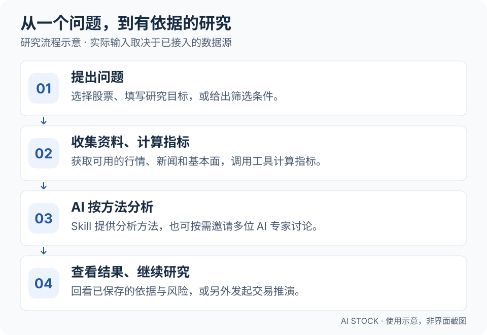
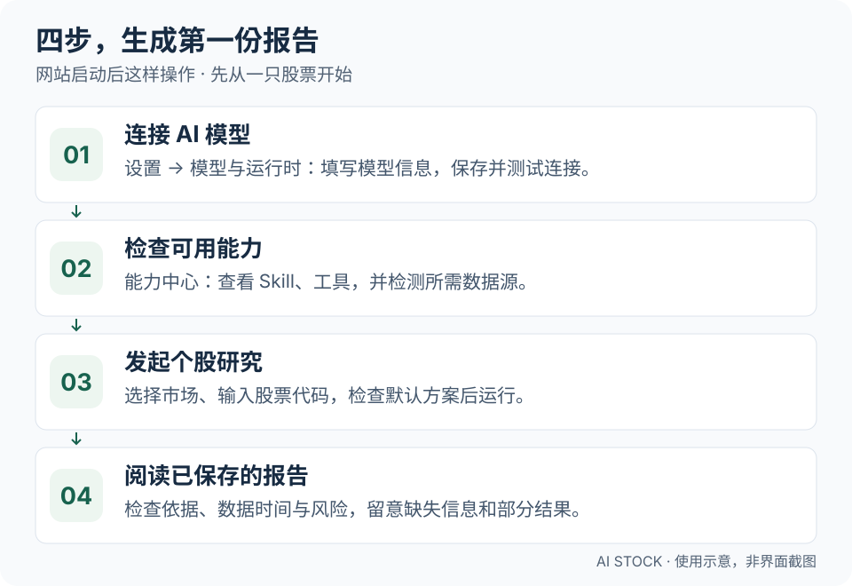

<div align="center">


# AI Stock

**用 AI 赋能每一位股票研究者，让个人也能拥有投研团队的研究能力，成为投资研究中的超级个体。**

让 AI 帮你查股票、看依据、比较观点，再用模拟资金检验策略。

投研助理 · 专家圆桌 · 个股研究 · 策略选股 · 交易推演

[](https://github.com/EthanAlgoX/AIStock/actions/workflows/ci.yml)
[](../LICENSE)
[](https://www.python.org/)
[](https://react.dev/)
[](https://fastapi.tiangolo.com/)

[English](../README.md) · **简体中文** · [繁體中文](README_CHT.md) · [日本語](README_JA.md) · [한국어](README_KO.md)

</div>

AI Stock 把行情、新闻、指标计算和 AI 分析放进同一个网站。你可以问一只股票、查看依据和风险、比较不同投资风格的观点，再用模拟交易观察策略表现。研究支持 **A 股、港股、美股、台股、日股、韩股，以及英、加、澳、印、德、法股票**；交易推演支持前六个市场。行情可用性和选股候选范围取决于数据源与配置，详见[海外市场指南](international-markets.md)。

## 在线体验（推荐）

想先体验？推荐直接使用已上线的 AI Stock 网站。**申请邀请码后注册登录即可使用，无需下载或自行部署。**

**[立即在线体验](https://myaistock.top/)** · **[申请邀请码](mailto:im.hanyx@gmail.com?subject=AI%20Stock%20%E9%82%80%E8%AF%B7%E7%A0%81%E7%94%B3%E8%AF%B7)**

点击**申请邀请码**会尝试打开你已设置的默认邮件应用，并填好收件人和主题；发送申请邮件后，作者会通过邮件回复邀请码。收到后前往网站注册并登录即可。已有账号的用户可以直接登录。

> **可以用你自己的邮箱申请：** Gmail、QQ 邮箱、163 邮箱、Outlook 等均可。点击后没有打开邮件应用时，可右键或长按申请链接，复制邮件地址，再到常用邮箱新建邮件，主题填写“AI Stock 邀请码申请”。若复制的是完整链接，只取 `mailto:` 后、`?` 前的地址作为收件人。

**从这里开始：** [能做什么](#能做什么) · [怎么工作的](#怎么工作的) · [安装并启动](#安装并启动) · [生成第一份报告](#生成第一份报告)

**选择语言：** 在网站顶部切换界面语言。界面文案随选择切换；历史报告、新闻原文和用户自定义内容保留原文。报告输出语言需单独配置。

## 能做什么

| 你想做的事 | 打开哪里 | 能得到什么 |
| --- | --- | --- |
| 看今天市场发生了什么 | 市场雷达 | 行情快照、新闻和宏观观察 |
| 随时问问题、继续追问 | 投研助理 | 可以回看的对话与研究结果 |
| 深入了解一只股票 | 个股研究 | 包含结论、依据和风险的报告 |
| 听听不同投资风格的观点 | 专家圆桌 | 多位 AI 独立分析，以及主持人总结 |
| 按条件找股票 | 策略选股 | 候选名单、排名和入选理由 |
| 看一个策略实际会怎么操作 | 交易推演 | 每日决策、模拟成交和账户表现 |

**可以这样提问：**“帮我研究 AAPL 最近的走势和重要新闻，分别列出看好与看空的依据，标明数据时间，以及哪些信息还缺失。”

内置全市场筛选规则主要面向 A 股。“专家”是基于投资框架设置的 AI 角色，并非本人。交易推演使用模拟资金，不会向券商提交实盘订单。

## 怎么工作的

<a href="assets/readme/how-it-works-zh.svg"></a>

1. **你给出问题或股票范围。** 可以从一句话、一个股票代码或一组筛选条件开始。
2. **系统找资料、算指标。** 根据数据源支持情况获取行情、基本面和新闻，调用工具查询数据、计算指标。
3. **AI 按方法分析。** 结合拿到的依据和策略说明形成判断，也可以邀请多个 AI 专家独立分析。
4. **你查看结果。** 回看报告、检查风险和缺失信息，或另外发起交易推演，观察策略表现。

页面里的 **Agent** 就是干活的 AI 助手，**Skill** 是分析方法说明书，**Tool** 是查询和计算工具，**MCP** 是连接外部工具的接口。第一次使用可以先选已启用的默认方案，不必先弄懂所有配置。

研究与模拟交易的输入不同：研究任务可以使用已接入的新闻、基本面等资料；交易决策使用所选策略、截至决策日的行情与模拟账户状态。详细边界见[交易推演说明](strategy-portfolios.md)。

## 安装并启动

推荐先[在线体验 AI Stock](https://myaistock.top/)，按上方说明[申请邀请码](#在线体验推荐)。**以下安装步骤仅供希望自行部署的用户使用。**

### 1. 准备环境

安装 **Python 3.10+、Node.js 20.19–26.x、npm 10+ 和 Git**。准备模型服务的 API Key（允许软件调用 AI 的密钥），并确认所选模型支持**工具调用**。在线模型可能按服务商规则消耗付费额度；也可以按[模型配置指南](LLM_CONFIG_GUIDE.md)了解本地模型等接入方式。

以下命令适用于 **macOS / Linux 终端**。Windows 或 Docker 部署请看[部署指南](DEPLOY.md)。

### 2. 下载项目、安装依赖

```bash
git clone https://github.com/EthanAlgoX/AIStock.git AI-Stock
cd AI-Stock

python3 -m venv .venv
source .venv/bin/activate
pip install -r requirements.txt

# 只在没有配置文件时创建，保留已有设置。
if [ ! -f .env ]; then cp .env.example .env; fi
```

已经下载过项目时，在项目的上级目录从 `cd AI-Stock` 开始即可，保留现有 `.env`。

### 3. 构建网页、启动服务

```bash
cd apps/dsa-web
npm ci
npm run build
cd ../..

python main.py --serve-only --host 127.0.0.1 --port 8000
```

浏览器打开 [http://127.0.0.1:8000](http://127.0.0.1:8000)。本地使用期间，请保持这个终端运行。`8000` 是示例端口；如果被占用，可修改 `--port`，浏览器地址也要使用相同端口。API 文档在 [http://127.0.0.1:8000/docs](http://127.0.0.1:8000/docs)。

**能打开网页只是第一步。** 完成下面的模型配置后，才能开始 AI 分析。

## 生成第一份报告

使用在线网站的用户，注册登录后直接进入**个股研究**或**投研助理**即可体验；下面第 3–4 步介绍如何发起研究和阅读报告。第 1–2 步的模型与数据配置面向自行部署的用户。

<a href="assets/readme/first-report-zh.svg"></a>

1. **接通 AI。** 进入**设置 → 模型与运行时**，选择服务商，填写 API Key 和模型信息，保存后测试连接。也可以在 `.env` 中配置，具体字段见[模型配置指南](LLM_CONFIG_GUIDE.md)。
2. **检查可用能力。** 在**能力中心**查看已启用的 Skill、工具和数据源。需要近期新闻时，配置相应新闻源；“已配置”不代表连接成功，可使用来源的可用性检测。
3. **先分析一只股票。** 打开**个股研究**，选择市场并输入代码，例如 A 股 `600519`、港股 `hk00700`、美股 `AAPL`。查看默认方案，按需填写研究目标，然后运行。默认方案仍需要对应模型、正式策略和工具可用。
4. **读报告、看依据。** 检查结论、数据时间、依据和风险，留意信息缺失与部分产出。想继续问就去**投研助理**，想比较不同观点就去**专家圆桌**。

第一次的研究目标可以写：“解释这只股票最近的趋势和主要风险，列出依据，无法确认的信息请明确说明。”上述股票代码仅用于演示输入格式，不代表推荐。

顶部可以切换英文、简体中文、繁体中文、日文和韩文。切换界面语言不会翻译已经生成的报告。

### 遇到问题先看这里

| 现象 | 先检查什么 |
| --- | --- |
| 网页能打开，分析却失败 | 模型设置是否已保存并测试通过，Key 是否有权限与额度，模型是否支持工具调用 |
| 默认方案无法运行 | 对应正式策略和所需能力是否已经启用 |
| 没有新闻或行情 | 数据源配置与可用性，以及运行记录中的报错或部分结果说明 |
| 关闭终端后任务不再执行 | 服务必须保持运行；关闭浏览器页面与关闭服务器是两回事 |

## 熟悉后，还可以做什么

- **比较不同观点：** 在专家圆桌选择专家，以及流水线、辩论或投票协作方式。[专家协作说明](expert-discussion.md)
- **检验交易策略：** 在交易推演选择 Skill，预览并确认股票范围，保存后运行一次或启动每日模拟。查看决策、交易成本和模拟成交。[交易推演指南](strategy-portfolios.md)
- **尝试 JEV 决策（可选）：** 在**设置 → 模型与运行时**配置独立的 TypeSafe API Key，新建交易策略时选择 **JEV · 仅决策结果**。它返回买入／卖出／不动、概率与置信度，不生成研究报告；聊天和股票范围筛选仍需要 LLM。申请入口见 [JEV 官方说明](https://typesafe.ai/blog/introducing-system-one-models-and-jev)和 [TypeSafe 控制台](https://console.typesafe.ai/)，使用方法见[JEV 配置指南](jev-trading-decisions.md)。
- **让任务定时执行：** 在本机或服务器上持续运行服务，浏览器可以关闭；如果服务就在本机，电脑关机后任务也会停止。[部署指南](DEPLOY.md)

## 文档与开发入口

| 你需要了解 | 对应文档 |
| --- | --- |
| 全部使用指南 | [文档索引](INDEX.md) |
| 模型服务与 API Key | [模型配置](LLM_CONFIG_GUIDE.md) |
| 详细配置与通知 | [完整指南](full-guide.md) |
| 部署方式 | [部署指南](DEPLOY.md) |
| 任务架构与能力权限 | [工作台架构](web-decision-workspace.md) |
| 可选的外部 Agent 引擎 | [运行引擎接入](agent-runtime-integration.md) |
| 测试与版本变化 | [测试指南](testing.md) · [更新记录](CHANGELOG.md) |

前端开发时，保持后端运行，在 `apps/dsa-web` 执行 `npm run dev`。Vite 默认使用 `5173` 端口，将 `/api` 代理到后端 `8000` 端口；后端地址不同时设置 `DSA_WEB_API_PROXY_TARGET`。

```bash
# 在仓库根目录执行
./scripts/ci_gate.sh

cd apps/dsa-web
npm run lint
npm run build
```

## 许可证与使用边界

本项目采用 [MIT License](../LICENSE)，用于投资研究及受控的历史或模拟交易实验。报告和模拟收益不保证未来表现；AI 历史回放可能受到模型训练知识的影响，不能据此认定策略能够盈利。

项目曾用名 LLM TradeBot、InvestCrew，现统一为 **AI Stock**，GitHub 仓库为 `EthanAlgoX/AIStock`。
