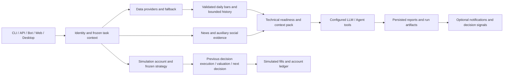

# Website workflows / 网站功能与执行逻辑

This map describes the routed Web application. A saved configuration, a completed model decision, and a simulated fill are distinct states.

本说明以当前 Web 路由及业务服务为准。“配置已保存”“模型已完成判断”“已产生模拟成交”是三个不同状态。

| Entry / 入口 | Input and responsibility / 输入与职责 | Output / 输出 |
| --- | --- | --- |
| Research assistant / 投研助理 | Questions, selected capabilities, optional expert collaboration / 对话需求、所选能力、可选专家协作 | Saved conversations and research; a separate strategy authoring conversation can produce a versioned Skill / 保存对话和研究；独立策略会话可生成版本化 Skill |
| Expert roundtable / 专家圆桌 | A topic, experts and collaboration mode / 主题、专家及协作模式 | Expert contributions and a synthesis / 专家发言与汇总 |
| Stock research / 个股研究 | One stock, a research strategy and available evidence; holding-linked research includes account context / 股票、研究方法和证据；关联持仓的研究带入账户上下文 | Evidence, conclusions, risks and reports / 证据、结论、风险与报告 |
| Strategy screening / 策略选股 | Screening strategy, market and scope / 选股策略、市场和范围 | Candidates and reasons, not orders / 候选和理由，不产生订单 |
| Trade simulation / 交易推演 | An approved universe, frozen Skill, model backend and account limits / 已确认股票范围、冻结 Skill、决策模型与账户约束 | Daily decisions, subsequent simulated fills, positions and equity history / 每日决策、后续模拟成交、持仓及净值历史 |
| Portfolio / 持仓管理 | Holdings or watch stocks, optional schedules / 持仓或关注股、可选跟踪计划 | Current briefs and independent daily score history / 当前简报与独立的每日评分历史 |
| Market radar / 市场雷达 | Market and news sources / 市场与资讯来源 | Research inputs / 研究输入 |

## Navigation and complete user journeys / 导航与完整用户旅程

Desktop uses seven top-level modules. Related pages use a horizontal page strip; Tasks keeps its existing shared page navigation. The public homepage `/`, trial `/try`, login and legacy route redirects keep their existing contracts. On mobile, the five bottom shortcuts remain; the top menu exposes every destination. Navigation does not grant permissions or change account ownership.

桌面采用七个顶部模块，关联页面在模块内横向排列；任务中心沿用已有共享页面导航。公共首页 `/`、试用 `/try`、登录及旧路由跳转保留原有契约。手机底部保留五个快捷工作台，顶部完整菜单可以访问所有功能。导航不改变权限或账户归属。

| Module / 模块 | Pages / 页面 |
| --- | --- |
| Market radar / 市场雷达 | `/market-intelligence`；首次默认美股，保留用户选择 / US first on initial entry, then retain the user's selection |
| Research / 投研工作台 | `/overview`、`/expert-review`、`/stock-research` |
| Screening / 策略选股 | `/screening` |
| Trade simulation / 交易推演 | `/trading` 总览、`?view=manage` 策略管理、`?view=source` 来源研究、`?view=reports` 历史提案 / overview, management, source research, historical proposals |
| Assets / 资产跟踪 | `/portfolio`、`/portfolio/ledger`、`/alerts` |
| Tasks / 任务中心 | `/runs`、`/runs/:runId`、`/schedules` |
| Workspace / 工作区设置 | `/capabilities` 及子页、`/usage`、`/settings`；成员显示“我的账户” / capability pages, usage, settings; members see My account |

Trading page links close an unsubmitted configuration form and show the requested view without saving or running it. Explicitly starting a new configuration retains the existing form reset behavior.

交易页签切换关闭未提交配置表单，展示所选页面，不自动保存或运行；主动新建配置仍沿用原有表单重置行为。

Conversation and report history open from the page toolbar at every screen size. Selecting a history entry closes the drawer and retains its route context. Skills, compression and expert collaboration use compact composer disclosures; opening or closing them does not submit a task or reset a draft. A roundtable's saved members remain frozen even when the capability directory changes; next-round changes are explicit and leave prior rounds intact. Report configuration still opens for source-linked tasks and stock archives keep their direct-link behavior. Errors, cancellation and runtime state remain visible outside collapsed configuration.

对话与报告历史均通过页面顶部按钮按需打开，选择后关闭抽屉并保留 URL 上下文。输入区的 Skill、压缩和专家协作配置采用紧凑折叠摘要；开关配置不提交任务，也不重置草稿。圆桌历史成员仍使用当轮冻结名单；显式调整仅影响下一轮，不改写历史。报告来源链接仍自动展开新任务配置，股票档案保留直链行为。错误、取消入口与运行状态保持可见，不藏进配置折叠区。

Settings categories move above the editor. `/settings?tab=model|system|notifications` supports direct links and browser back/forward while preserving other query parameters and unsaved configuration. The member account page retains its separate permissions. New workspaces default to the warm light theme; existing theme preferences remain effective, including dark and system modes.

设置分类移到编辑内容上方。`/settings?tab=model|system|notifications` 支持直链与浏览器前进/后退，保留其它参数和未保存配置；成员账户沿用独立权限。首次使用默认暖白主题，已有主题选择继续生效，可切换深色或跟随系统。

| User task / 用户任务 | Entry and action / 入口与操作 | Saved result and next action / 成果与后续动作 |
| --- | --- | --- |
| Find a research question / 寻找研究问题 | `/market-intelligence`: select the market, inspect news and available recaps / 选择市场，查看资讯与可用复盘 | Use the evidence in assistant discussion or stock research; loading/failure is not a fresh recap / 将证据用于助理讨论或个股研究；读取中或失败不代表已有新复盘 |
| Ask or develop a method / 提问或形成方法 | `/overview`: choose methods and optional experts, enter a question; use the separate strategy conversation to save a Skill / 选择方法和可选专家后提问；独立策略会话可保存 Skill | Continue the saved conversation, inspect linked runs, or bring the saved method into a structured task / 继续保存的会话、查看关联运行，或将方法带入结构化任务 |
| Compare expert views / 比较专家观点 | `/expert-review`: choose experts and pipeline, debate or voting, then send a topic; report links can supply `sourceRun` / 选择专家及流水线、辩论或投票方式，提交主题；报告入口可携带 `sourceRun` | Saved contributions, synthesis and run evidence; ask a follow-up without rewriting earlier rounds / 保存发言、汇总及运行证据；继续追问，不改写历史讨论 |
| Research a specific stock / 研究一只股票 | `/stock-research`: open new research, select a market and a stock search result, choose a method and optional focus question, then run / 新建研究，选市场并点击股票结果，选择方法与可选关注问题后运行 | A saved report in the report directory; continue with the assistant, invite experts, inspect run details or schedule future research / 报告存入目录；可继续问助理、邀请专家、查看运行详情或设置后续研究计划 |
| Screen and study candidates / 筛选并研究候选 | `/screening`: select the screening strategy, enter interpretation goals and optionally research the top candidates, then run / 选择筛选策略，填写解读关注点，按需深研前列候选后运行 | A candidate list and optional stock reports; inspect a stock archive or generate a research-only trading proposal / 候选名单及可选个股报告；可查看股票档案，或生成仅供研究的交易提案 |
| Validate a saved strategy / 验证已保存策略 | `/trading`: configure Skill, market, confirmed scope and account limits, save, then explicitly choose and confirm a run mode / 配置 Skill、市场、已确认范围和账户约束，保存后明确选择并确认运行模式 | A simulation account with decisions, eligible fills and equity history; inspect, pause, stop or create a separate replay / 模拟账户记录决策、符合约束的成交与净值；可查看、暂停、停止或另建回放 |
| Record and track holdings / 记录并跟踪持仓 | `/portfolio`: record holdings or add a watch stock; `/portfolio/ledger` manages recorded accounts and transactions / 录入持仓或添加关注股；持仓账本管理记账账户与交易流水 | User-recorded positions, briefs and daily research score history; run research manually or save future tracking / 用户记账仓位、简报及每日研究评分；可手动研究或保存后续跟踪计划 |
| Receive a price alert / 接收价格告警 | `/alerts`: choose a symbol, threshold, cooldown and available delivery channel, then save and enable the rule / 选择标的、阈值、冷却时间及可用渠道，保存并启用规则 | An enabled monitoring rule and observable delivery status; review or disable it, without placing an order / 启用监控规则并观察投递状态；可查看或停用，不产生订单 |
| Automate future work / 安排后续工作 | `/schedules`: configure stock research or screening, or bind a saved trading-proposal task, then register a schedule / 配置个股研究、选股，或绑定已保存的交易提案任务后注册计划 | Next execution time and future runs; toggle/delete the plan and inspect executions in `/runs` / 下次执行时间与后续运行；可启停或删除计划，并在运行页查看执行 |
| Inspect an outcome or failure / 核对结果或失败 | `/runs`: filter by task, status, market or date; open `/runs/:runId` / 按任务、状态、市场或日期筛选后打开运行详情 | Saved artifacts, input/configuration and provenance; continue discussion, inspect the linked account/report, stop supported work or explicitly rerun / 成果、输入配置及溯源；可继续讨论、查看关联账户或报告、停止支持的任务或明确重跑 |
| Prepare capabilities / 准备可用能力 | `/capabilities`, `/capabilities/skills`, `/capabilities/tools`, `/capabilities/mcp`, `/capabilities/data`, `/capabilities/experts`: inspect or configure the relevant method, tool, connection, source or expert / 查看或配置方法、工具、连接、数据源及专家 | Registry choices available to later tasks; configuration alone does not execute a task, and members see managed MCP/data information / 注册能力供后续任务选择；配置不会启动任务，成员查看平台托管 MCP／数据源说明 |
| Configure access and check consumption / 配置访问并检查消耗 | `/settings`: platform settings for administrators, My account and personal API for members; `/usage`: inspect actual model usage / 管理员使用平台设置，成员使用我的账户及个人 API；用量页查看真实模型消耗 | Saved settings and usage records; verify the model through an explicit task, keeping credentials and workspace ownership isolated / 保存设置与用量记录；需明确发起任务验证模型，密钥与工作区归属保持隔离 |

The holding ledger, run details and individual capability pages are contextual destinations rather than extra primary workspaces. Legacy `/chat`, `/research`, `/simulation` and editor URLs keep their existing compatibility redirects; they are not separate workflows.

持仓账本、运行详情和各能力配置页是上下文入口，不额外扩张主工作台。旧 `/chat`、`/research`、`/simulation` 及编辑器 URL 保留原兼容跳转，不作为独立流程。

## Configure, run and read / 配置、运行与阅读

The stock-research and screening workspaces prioritize the report directory and conclusions. Opening configuration retains the last draft; collapsing it does not submit a task. The market selector keeps every existing market option while stock search remains scoped to the chosen market. Select a search result before running stock research. The manual run uses the selected method, question and capability bindings; optional expert controls and method explanations can be expanded when needed. Run details retain the frozen configuration and data sources without requiring users to understand published graph identifiers.

个股研究与选股优先展示报告目录和结论。展开配置会保留上次草稿，收起不会提交任务。市场下拉保留全部已有市场，股票搜索仍限定当前市场，个股研究须先点击搜索结果。正式运行使用所选方法、关注问题与能力绑定；专家控件和方法说明按需展开。运行详情保留冻结配置与数据来源，不要求用户理解发布图标识。

Crypto research selects spot USDT pairs and freezes the `CRYPTO` market with the canonical pair in the task. The stock archive uses the URL stock context, canonical catalog identities and recognized suffixes to select the market for new research. A later catalog response preserves an explicit manual choice; changing the stock resets that choice. Bare numeric codes are not guessed as foreign listings from display codes: `006208` remains a CN-format input, while `006208.TW` identifies Taiwan. History filters, default-plan preparation and the subsequent task use the same normalized subject. A market/subject mismatch is still validated by the backend.

加密研究选择现货 USDT 交易对，任务同时冻结 `CRYPTO` 市场与标准交易对。股票档案根据 URL 股票上下文、目录标准身份及已识别后缀选择新研究市场。晚到的目录结果保留用户显式手动选择，股票变化则重置该选择。裸数字不会按目录显示代码猜成海外标的：`006208` 保持 CN 格式输入，`006208.TW` 才识别为台湾。历史筛选、默认方案准备和后续任务使用同一标准标的，市场与标的不匹配仍由后端校验。

“Try a ready-to-run plan” is a separate, collapsed secondary entry. Expanding it only reveals the plan; only its run button submits work. The backend supplies its stock, method and experts, using the currently selected stock where provided. It does not use manually entered focus questions or collaboration settings, and does not replace the manual draft. It uses real data and models, so an explicit run can incur charges.

“快速试用默认方案”是独立、默认折叠的次级入口。展开只显示方案，点击其中的运行按钮才提交任务。方案由后端提供股票、方法与专家，传入已选股票时使用该股票，不采用手填关注问题或协作配置，也不覆盖手动草稿。它使用真实数据与模型，明确运行后可能产生调用费用。

Research/screening run buttons create and execute a task now; their scheduling buttons only open the scheduler with the current configuration. Registering a plan schedules future work without executing immediately. A saved simulation strategy is a different object: it creates no simulation account until a run mode is confirmed. Historical `/trading?view=reports` saves research proposals without account fills, and its saved tasks can be scheduled. Continuous account simulation is controlled from the main trading workspace; the generic trading-proposal schedule does not activate it.

研究／选股的运行按钮立即创建并执行任务，定时按钮只携带当前配置打开计划页。注册计划只安排未来工作，不立即执行。保存模拟策略是另一类对象，确认运行模式前不会创建模拟账户。历史 `/trading?view=reports` 保存不产生成交的研究提案，其任务可用于定时计划。账户持续模拟由交易主工作台控制，通用交易提案计划不会启用它。

Enabling or pausing a plan controls future scheduling. A cycle already claimed or started may continue; cancellation of a run is a separate action. Deleting a plan requires confirmation and removes only the schedule, preserving its task and run history. Creation blocks repeated clicks while a request is pending and reuses a confirmed task if schedule creation fails; it does not promise server idempotency after an uncertain network response.

启用或暂停计划控制后续调度，已经领取或启动的本轮可能继续，停止某次运行是独立操作。删除计划须确认，仅移除计划，保留任务与运行历史。创建时阻止请求在途重复点击；计划创建失败后复用已确认保存的任务，但不承诺网络响应不确定时的服务端幂等。

## Research and tracking / 研究与跟踪

- Holding research reads the actual holding context. Watch research does not infer positions or produce holding actions. Completed scores are assembled into a curve after independent research; previous report conclusions are not injected into the next analysis.
- “Save & enable tracking” saves the cadence, market-local time and notification preference. It enables scheduled research without running immediately. A manual research action is separate.
- Tracking uses calendar-day intervals. Trade simulation uses exchange sessions and closed daily bars. These schedules have different semantics.
- Scheduled research notifications require both the per-task notification choice and a configured delivery channel. The channel configuration alone does not start research.

持仓研究读取实际持仓；关注股研究不推断仓位、不输出持仓操作建议。每日分析独立完成后，再汇总评分曲线。保存跟踪配置只启用计划，不立即研究；临时研究走手动入口。跟踪周期按自然日，交易推演按交易日，两者不能混用。定时研究通知还需要任务通知开关和已配置渠道，配置渠道本身不会启动研究。

New stock-research plans automatically prepare the built-in published research configurations for the selected market. Users choose the available method and capabilities; they do not need to publish a legacy StrategyVersion. Disabled required tools or an archived built-in configuration still require attention.

新建个股研究自动准备所选市场的内置正式研究配置，用户选择可用方法与能力即可，无需手动发布旧 StrategyVersion。必要工具被禁用或内置配置被归档时，仍需检查默认方案。

## From a strategy to daily simulation / 从策略到每日推演

1. Discuss and save a Skill, or select an existing Skill.
2. Choose a market and stock scope. For natural-language scope preview, obtain market/industry candidates first, then let the LLM select from that evidence.
3. Review the preview and save the strategy. This does not create a running simulation.
4. Choose a single run, continuous paper trading or AI historical replay, and confirm the validation parameters.
5. For each eligible day, simulate execution of the previous decision at the open, value positions at the close, then produce the next decision. A decision may produce no fill because of cash, lot or allocation limits.

先保存或选择 Skill，再选择市场与股票范围。自然语言范围先取得市场／行业候选，再由 LLM 从证据中筛选。核对预览并保存策略后，还需选择单次运行、持续模拟或 AI 历史回放。每日步骤先执行上一决策的模拟买卖，再估值并形成下一决策；有决策不等于必然成交。

JEV is an explicitly selected decision backend. It returns buy/sell/hold with probabilities and confidence; the program applies the configured allocation step and execution constraints. Research, chat and natural-language universe screening still require the configured LLM. JEV errors do not silently switch the backend. See [JEV execution](jev-trading-decisions.md).

JEV 需显式选择，输出买入／卖出／不动及概率、置信度；程序负责调仓比例和执行约束。研究、对话与自然语言范围筛选仍用 LLM。接口失败不会静默切换模型。当前没有低置信度自动停交易阈值。

Pausing a simulation stops automatic trading but keeps holdings valued. It does not mean removing historical records. Starting a server or saving an API key does not enable a strategy. The server must remain running for scheduled work; a local browser need not stay open.

暂停模拟是停止自动买卖、保留持仓估值，并非删除历史。启动服务器或保存 API 密钥不会自动启用策略。定时任务需要服务器持续运行，不需要本地浏览器保持打开。

## Supporting controls / 支撑入口

历史会话加载会恢复消息和历史方法选择，但不能覆盖用户在加载期间新做的显式选择（包含清空）。主动新建对话仍重置选择；已提交的问题使用提交时的选择。

Session history restores messages and prior methods without overwriting explicit selections made during loading, including an empty selection. A user-created new conversation resets the selection; submitted questions keep their submitted methods.

Tasks & Runs records execution status and artifacts; Scheduled tasks controls future execution; Model usage records consumption. Settings configures model services and delivery channels; the Capability Center manages selectable methods and tools. Members have private workspaces and can configure a personal LLM API in My account. Invited accounts without a personal API use the available platform allowance; accounts without an invitation have no platform allowance. Personal API failures do not switch to platform credentials.

任务与运行保存执行状态与成果；定时任务管理未来执行；模型用量记录消耗。设置管理模型服务与通知渠道，能力中心管理可选择的方法与工具。成员业务数据保存在私有工作区，可在“我的账户”配置个人 LLM API。未配置个人 API 的受邀账号使用尚余的平台额度；无邀请码账号没有平台额度。个人 API 失败不会切换至平台密钥。

See [holding research](holdings-research.md), [strategy execution](strategy-portfolios_EN.md) and [strategy execution in Chinese](strategy-portfolios.md) for detailed contracts.

## End-to-end execution / 端到端执行

行情先由 `data_provider/` 标准化并校验，自动路由失败后按现有顺序切换来源；明确指定的数据源保留单源语义。必要日线日期/OHLCV 无效时拒绝整批，不能补造价格、把缺失量填零或删除坏行后假装连续。历史加载的数据库查询和网络请求使用同一截止日，并过滤越界返回。技术分析只用当前有效窗口，标记指标预热及估算日线，规则事件保留数值证据。新闻按检索结果保留出处并保守去重；社交独立作为未经核实的辅助输入。详见 [信号证据](signal-evidence.md)。

Market adapters normalize and validate data before existing automatic failover; explicitly selected providers remain single-source. Invalid required daily fields reject the batch. Database and network history share an upper date bound, with out-of-window responses filtered. Technical analysis exposes warmup and estimated bars; news retains provenance, and social input stays auxiliary. See [signal evidence](signal-evidence_EN.md).

普通分析由 `src/core/pipeline.py` 编排，Agent 由 `src/agent/` 执行已有受控工具，两者使用同一上下文证据边界。模型生成研究结论，后端保存报告、任务/运行与成果后才按配置发送通知或提取决策信号。信号池是建议及后验跟踪，不是实盘订单。策略账户的确定性日线执行另有领取、持仓、现金、交易单位与估值约束；报告评分曲线不能替代账户净值。

The standard pipeline and Agent use the same evidence boundaries. Reports and run artifacts are persisted; configured notifications and decision signals consume those results. Signals are research suggestions, not brokerage orders. Simulation accounts independently enforce execution and valuation constraints. Research score curves are not account equity curves.

## Feature and ownership inventory / 功能与模块归属

| Capability / 功能 | Actual entry and implementation / 入口与实现 | Logic boundary / 逻辑边界 |
| --- | --- | --- |
| Stock, market and crypto research / 个股、大盘与加密资产研究 | `/stock-research`, `/market-intelligence`; `src/core/`, `src/market_analyzer.py`, `src/services/crypto_*` | Market-specific evidence and persisted recaps; legacy `/crypto` redirects to the radar / 按市场使用证据并保存复盘；旧加密路由跳转雷达 |
| Conversations, experts, Skills and tools / 对话、专家、方法与工具 | `/overview`, `/expert-review`, `/capabilities/*`; `src/agent/`, workspace and expert services | Capability allowlists, frozen task inputs, model usage and per-user ownership / 能力白名单、冻结输入、模型用量与用户归属 |
| Screening and stock archives / 选股与股票档案 | `/screening`; screening and workspace services | Actual strategy rules produce candidates; natural-language interpretation does not invent filters / 真实策略规则产生候选，文字解读不补造筛选条件 |
| Holdings, watchlists and account ledger / 持仓、关注与账户账本 | `/portfolio`, `/portfolio/ledger`; portfolio services/repositories | Recorded positions and cash differ from recommendations and simulation accounts / 用户记账区别于建议与策略模拟账户 |
| Replay and continuous simulation / 回放与持续模拟 | `/trading`; simulation portfolio service/engine/repository | Previous-day decisions execute on the next eligible open; constraints can reject fills / 上一日决策在后续有效开盘执行，约束可拒绝成交 |
| Historical published-strategy research / 历史正式策略研究 | Strategy definition/research/continuous services; existing API compatibility | Immutable published graphs and repeated research batches; no account fills / 冻结正式图及重复研究批次，不产生账户成交 |
| Scheduled work and run history / 计划与运行历史 | `/schedules`, `/runs`, `/runs/:runId`; workspace service and lifecycle workers | Atomic due claims, cooperative cancellation, persisted failures and artifacts / 原子领取、协作停止、失败与成果持久化 |
| Alerts, signals and delivery / 告警、建议池与推送 | `/alerts`; decision-signal, alert and notification modules | Trigger/cooldown and actual channel success; failures remain observable / 触发与冷却按实际投递成功记账，失败可观察 |
| Settings, models and usage / 设置、模型与用量 | `/settings`, `/usage`; config registry, model routing and usage services | Protected credentials, configured routing, member reservations and usage settlement / 受保护密钥、配置路由、成员额度预留与结算 |
| Identity and private workspaces / 身份与私有工作区 | Auth middleware, member service, `AuthContext` | Private database and worker scope; identity changes invalidate old client responses / 私有数据库与工作线程归属，切换身份后旧请求不能回填 |
| CLI, bots and local desktop / 命令、机器人与桌面 | `main.py`, `server.py`, `bot/`, `apps/dsa-desktop/` | Reuse backend services; desktop manages local backend and restricted navigation / 复用后端服务，桌面管理本地后端及导航边界 |
| Deployment and release / 部署与发布 | `scripts/`, `docker/`, `.github/workflows/` | Backend/Web gates, frozen executable, container imports; tags remain opt-in / 后端及 Web 门禁、冻结可执行文件、容器导入；版本 tag 保持显式启用 |

旧 `/chat`、`/strategies/*`、`/strategy-editor`、`/backtests` 等路由仍按 `App.tsx` 跳转，不能把旧编辑器文档当作当前可访问页面。数据落库复用 `src/storage.py`、repositories 及私有工作区 SQLite；报告、任务成果、模型账本与模拟每日账本各自保留归属和日期，不能互相推断成功。

Legacy routes follow `App.tsx` redirects; old editor documents do not describe current navigable screens. Storage reuses existing repositories and workspace SQLite. Reports, artifacts, model usage and simulated daily ledgers retain separate ownership, dates and success states.

模拟账户线程提交失败会释放本次租约并保留错误，允许立即手动重试。历史自动研究 API 若无法入队，已创建批次记录为失败并返回 `503 / AUTO_RUN_QUEUE_UNAVAILABLE`；不能把持久化成功当成后台任务已接受。内部持续研究的未入队批次仍由原控制器执行。

Rejected simulation submissions release their own lease and retain a queue error for manual retry. The legacy automatic-research API records a failed batch and returns `503 / AUTO_RUN_QUEUE_UNAVAILABLE` if submission fails. Persisting a record does not prove worker acceptance; internal unqueued continuous batches retain their existing controller contract.

## Recovery and verification / 恢复与评测

计划领取有 10 分钟租约与领取者校验；领取提交即接受本轮，后续计划编辑不撤销已领取启动，Run 停止是独立操作。存活进程内停止持续研究允许当前批次完成，但后续代际必须等原批次退出；ASGI 正常生命周期关闭时，先协作停止任务生产者，再通知管理员与成员的持续研究控制器退出。CLI／桌面终止进程不保证在途批次完成，下次启动记录中断的一次性研究，恢复持久化 `running` 控制的后续周期，不重放原批次或写入另一工作区。浏览器注销或切换身份清空状态并使旧异步响应失效。

Due schedules have a ten-minute owner-checked lease. A committed claim accepts that cycle; later plan edits do not revoke the launch, and Run cancellation is separate. Within a live process, continuous research stops future cycles while an in-flight batch completes; replacement generations wait for that batch. Normal ASGI lifespan shutdown cooperatively stops producers before owner/member controllers. CLI/desktop process termination can interrupt a batch. Restart marks interrupted one-off research and resumes future durable cycles without replaying the original batch or writing into another workspace. Identity changes invalidate stale browser responses.

完整评测分后端确定性门禁、Web 全套测试/lint/build、隔离数据库的认证浏览器场景、桌面测试与打包、容器及线上集成。命令和覆盖边界见 [测试说明](testing.md)。本地通过不代表真实 LLM、SMTP、所有行情供应商、实盘交易或盈利已验证；平台缺失的检查必须在交付记录中单列。

Evaluation covers deterministic backend gates, Web tests/lint/build, isolated authenticated browser checks, desktop tests/package and container/live integrations. See [testing](testing.md). A local pass does not validate real LLM/SMTP calls, every provider, brokerage execution or profitability; unavailable platform checks must be reported separately.
